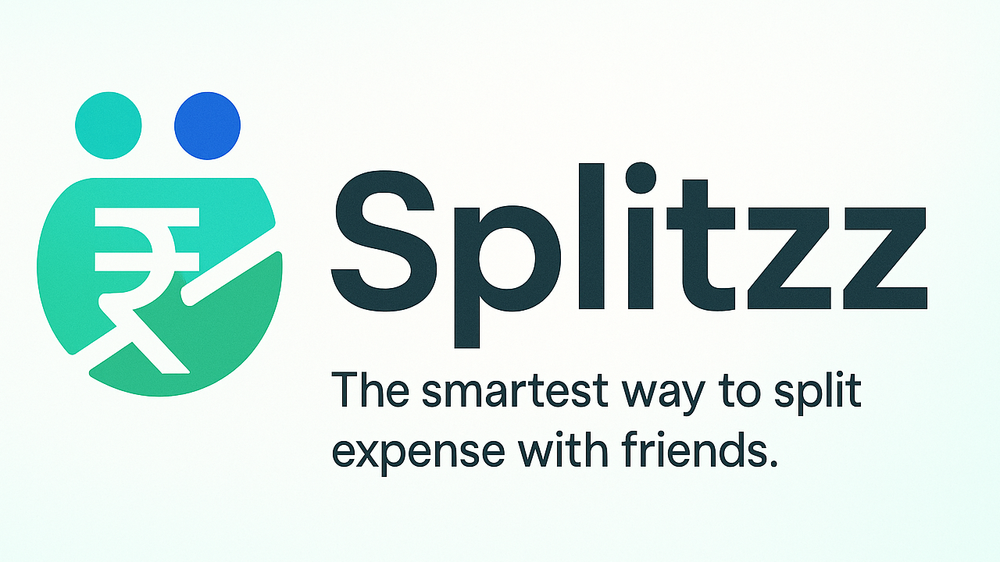
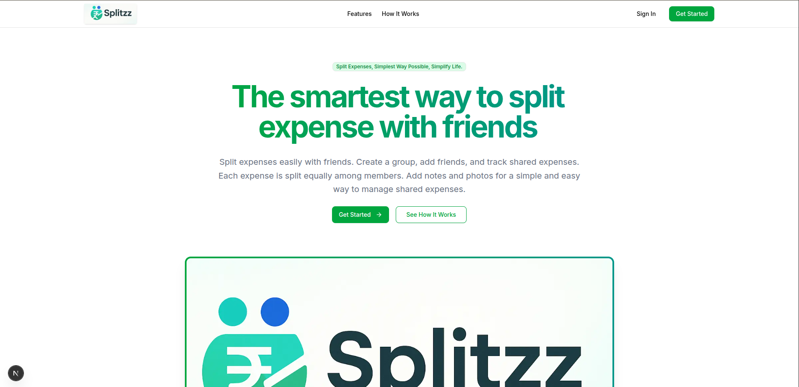
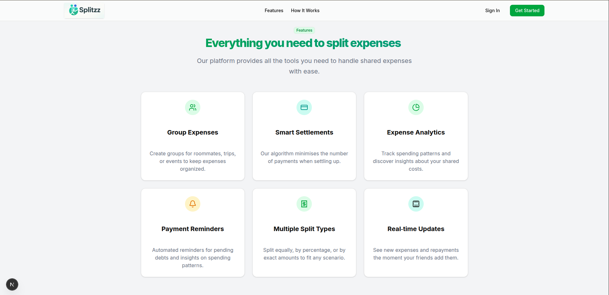
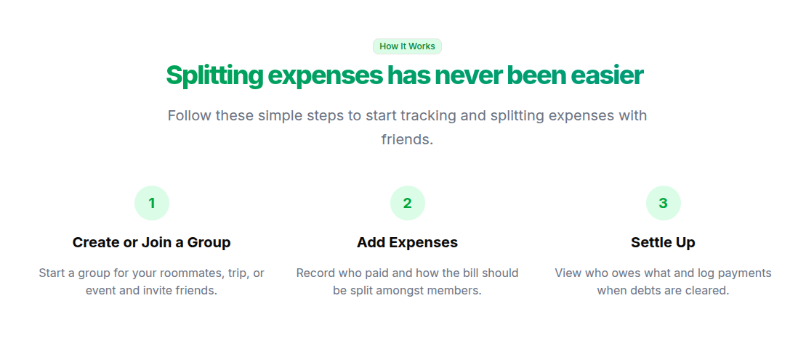
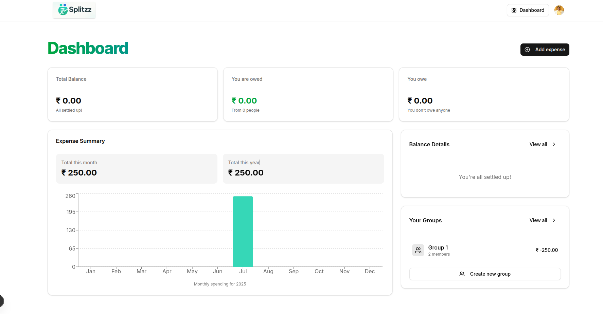
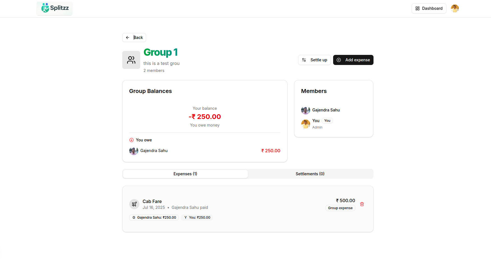

<div align="center">
  
  <p align="center">
    <a href="https://gajju2309.vercel.app">Gajendra Sahu</a>
    <br>
    <a href="mailto:gajmain2020@gmail.com">gajmain2020@gmail.com</a>
  </p>
</div>

# Splitzz

Splitzz is a personal finance app built with Next.js, Convex, and Inngest. It allows users to track their expenses, income, and savings goals. The app also provides a dashboard to view expenses by category and a leaderboard to compare with friends.

## Features

- Track expenses, income, and savings goals
- View expenses by category
- Compare with friends on a leaderboard
- Get personalized spending insights
- Create groups to split expenses with friends

## Tech Stack

- **Frontend**: Next.js, Tailwind CSS, Shadcn UI
- **Backend**: Convex, Inngest, Clerk
- **Database**: Convex

## Screenshots

### Landing Page



### Features



### How It Works



### Dashboard



### Group



## Development

### Run Locally

1. Clone the repo
2. Run: `npm install`
3. Run: `npm run dev`
4. Open: [http://localhost:3000](http://localhost:3000)

### Convex

Convex is a serverless database that provides real-time data synchronization and offline support. To learn more, check out the [Convex documentation](https://convex.dev/docs).

### Inngest

Inngest is a serverless functions platform that allows you to run code on a schedule or in response to events. To learn more, check out the [Inngest documentation](https://docs.inngest.com).

### .env.example

```bash
# CONVEX
CONVEX_DEPLOY_KEY=
CONVEX_DEPLOYMENT=
NEXT_PUBLIC_CONVEX_URL=

# CLERK
NEXT_PUBLIC_CLERK_PUBLISHABLE_KEY=
CLERK_SECRET_KEY=
NEXT_PUBLIC_CLERK_SIGN_IN_URL=/sign-in
NEXT_PUBLIC_CLERK_SIGN_UP_URL=/sign-up

CLERK_JWT_ISSUER_DOMAIN=

# RESEND
RESEND_API_KEY=

# GEMINI
GEMINI_API_KEY=
```
